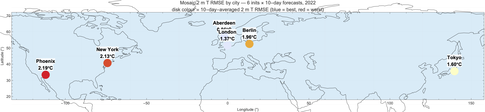
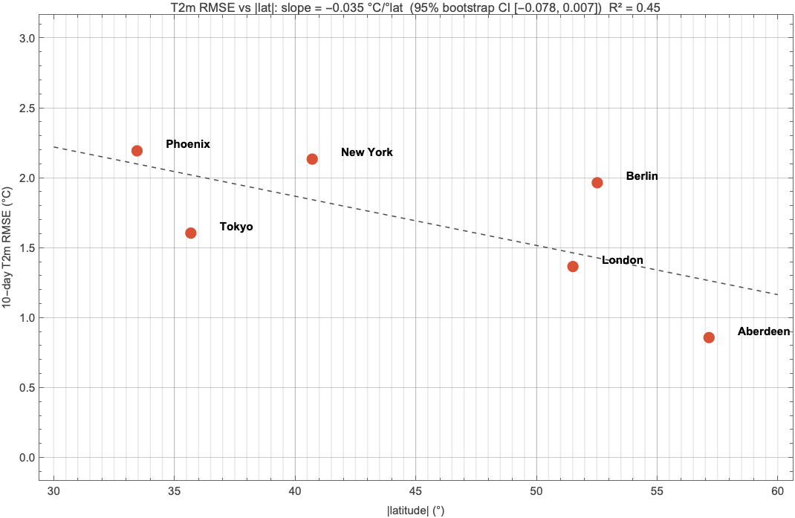
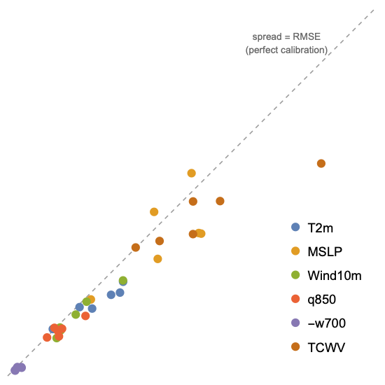
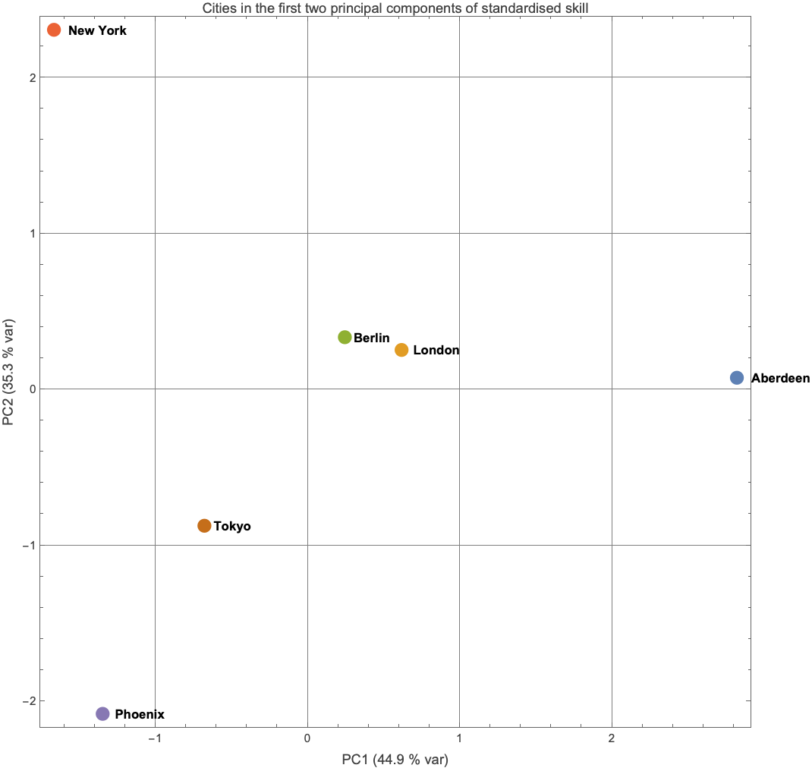
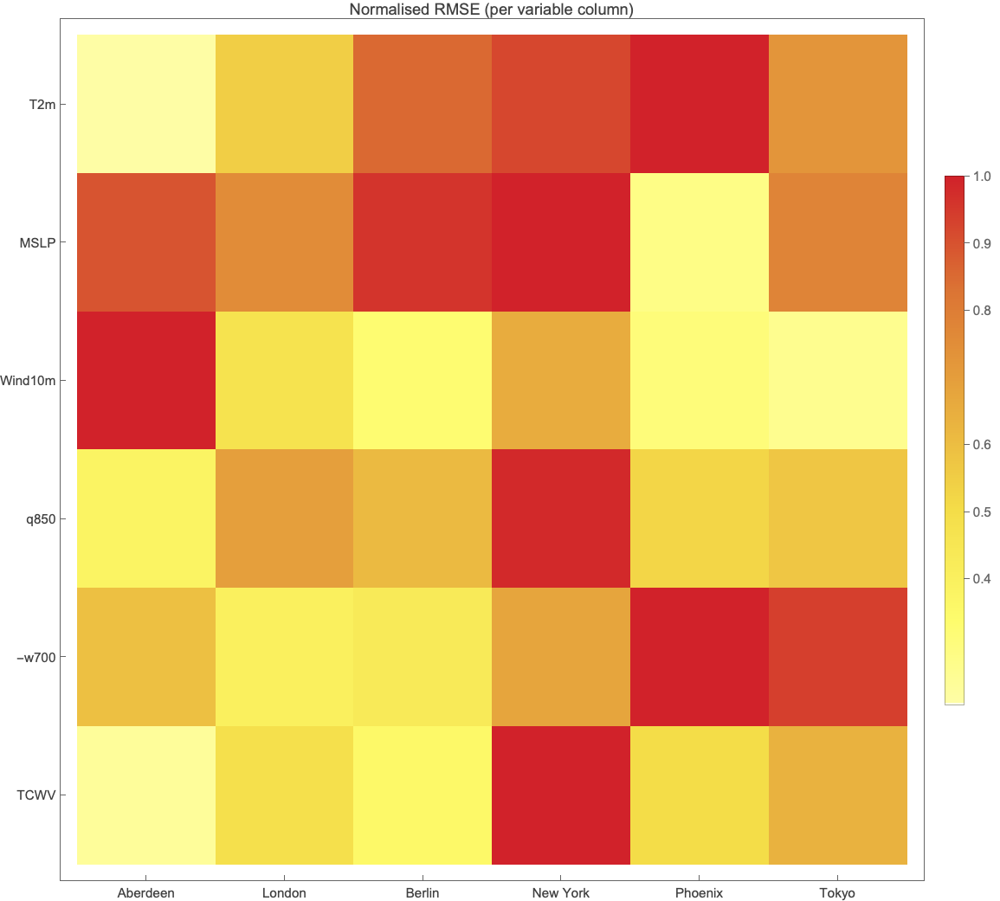
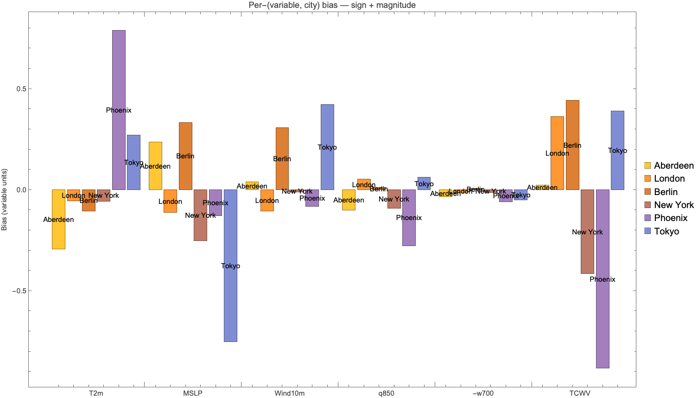
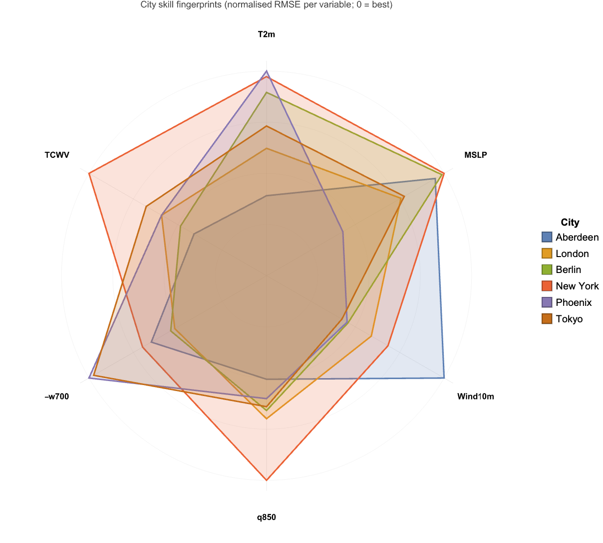

# Mosaic at home: 16-member ensemble weather forecasts from a Mac mini, analysed in Wolfram Language

*A practical guide — what we learned setting it up, the assessment data, and what Wolfram adds to the picture*

---

## TL;DR

**Mosaic** (Zhdanov, Lucic, Welling, van de Meent — ICML 2026, 214 M parameters, CC-BY-NC-4.0) produces 24-member 10-day weather forecasts in roughly twelve seconds on an H100. The model paper covers that beautifully and there's little point repeating it here.

This post is about the **engineering and analysis** layer that sits between "pip install flash-attn" and "what does this model actually tell me about Aberdeen next week". Three parts:

1. **Practical setup** — what we tried, what failed, what works. This is the hard-won knowledge: a 12-hour compile that should have been 30 min, OOM on small runtimes, Drive-FUSE traps, an inductor-cache misadventure. Skip the model paper and read this if you want to *run* Mosaic.
2. **The assessment** — six cities × six init dates × six variables, processed in Wolfram Language. Statistics, calibration, PCA, animation.
3. **Closer Wolfram integration** — concrete code patterns for reading Mosaic's `.npz` outputs natively in WL, calling Python from inside Mathematica, comparing against WL's built-in `WeatherData`, deploying a forecast endpoint via `CloudDeploy`.

The Wolfram notebook companion (`mosaic_community.nb`) embeds the dataset as an Association and reproduces every plot below. No external CSVs.

---

# Part 1: Practical setup — every lesson from running Mosaic on Colab

## Is Mosaic safe to clone and run?

Yes. Research code from a reputable group; no `setup.py` and no install-time hooks. We mirrored to a private GitHub fork for a workspace. The CC-BY-NC license forbids commercial use without a separate license.

## What runtime do you actually need?

The model **runs** on Ampere or Hopper GPUs (compute capability ≥ 8.0) — A100, H100, L4 work. T4 (sm_75) and V100 (sm_70) do **not** because flash-attn won't run on them.

Crucially, the **flash-attn build is CPU-bound**: `nvcc`/`cicc` does all the work, the GPU sits idle for the entire compile.

| Phase | Recommended runtime |
|---|---|
| One-time flash-attn wheel build | T4 (~$0.20/h) is fine if you set `TORCH_CUDA_ARCH_LIST=8.0;9.0` to target the right archs |
| Actual forecasts | A100 (~$1.40/h) or H100 |

## The flash-attn build is the single biggest gotcha

Our first attempt ran ~12 hours before we realised three things compounded:

1. **`MAX_JOBS` wasn't propagating.** `subprocess.run(['pip', 'install', 'flash-attn'], env={**os.environ, 'MAX_JOBS': '4'})` builds effectively serially. Use the shell form `!MAX_JOBS=4 pip install flash-attn --no-build-isolation` or `os.system` for proper env-var propagation.
2. **The build defaulted to compiling for four GPU architectures** (sm_80, sm_90, sm_100, sm_120) because CUDA 12.8 supports the latest Blackwell. We only needed sm_80 + sm_90. Setting `TORCH_CUDA_ARCH_LIST='8.0;9.0'` halves the work.
3. **OOM on T4** with `MAX_JOBS=4`: each `cicc` instance peaks at ~3-4 GB; on a 13 GB T4 with two architectures running simultaneously you blow through RAM. Auto-size `MAX_JOBS` from `/proc/meminfo`: < 16 GB → 1; 16-32 → 2; > 32 → 4.

`pip install` is silent during compile. We diagnosed via `ps -eo pid,pcpu,pmem,etime,comm --sort=-pcpu | head` in a Colab Terminal (Tools → Terminal — needs Pro+). If you see active `cicc`/`ptxas` processes with growing ETIME, the build is alive.

**With all three fixes, a fresh build is ~30 min on A100 or ~60-90 min on T4.**

## Cache the wheel on Drive — but NOTHING else

A successful build produces a ~200 MB `.whl`. Save it on Drive, namespaced by `(python, torch, cuda)`:

```
Drive/WeatherMosaic/wheels/cp312-torch2.10-cu128/flash_attn-2.8.3-...-linux_x86_64.whl
```

Future Colab sessions install in ~30 seconds.

**Do NOT put anything else on Drive that requires many-file I/O.** Drive's FUSE filesystem has ~100-1000 ms per syscall. That's fine for one 200 MB wheel; it's catastrophic for the torch.inductor cache (thousands of tiny `.so`/`.json`/`.cubin` files). We initially put `TORCHINDUCTOR_CACHE_DIR` on Drive — it stalled `torch.compile` for **6+ hours**.

The fix: keep inductor cache in `/tmp/inductor_cache` (local fast disk) and accept the ~1-3 min first-forecast compile cost each session. That's far cheaper than any Drive sync. Same lesson applies to `huggingface_hub.snapshot_download` — short-circuit it if the expected files already exist on Drive; don't let it re-hash thousands of files through FUSE.

## The final, stable setup

```python
# Cell 1: GPU + Drive
!nvidia-smi --query-gpu=name,compute_cap,memory.total --format=csv
from google.colab import drive; drive.mount('/content/drive')
DRIVE_ROOT = '/content/drive/MyDrive/WeatherMosaic'

# Cell 2: load mosaic_pipeline.py (embedded in our bootstrap notebook)
# Cell 3: install
mp.ensure_repo()
mp.pin_inductor_cache(DRIVE_ROOT)         # /tmp, not Drive
!grep -v '^flash-attn' /content/mosaic/requirements.txt > /tmp/req_no_fa.txt
!pip install -q -r /tmp/req_no_fa.txt huggingface_hub matplotlib gcsfs
print(mp.install_flash_attn(DRIVE_ROOT))  # ~30s if wheel cached on Drive
mp.ensure_weights(DRIVE_ROOT)             # short-circuits if files present

# Cell 4: forecast
runner = mp.MosaicRunner(variant='era5', drive_root=DRIVE_ROOT, use_compile=True)
spec   = mp.ScenarioSpec(name='aberdeen', variant='era5',
                         init_time='2022-12-15T12:00',
                         steps=10, members=16, zarr=ZARR_URI, with_truth=True)
status = runner.run(spec, f'{DRIVE_ROOT}/forecasts/aberdeen.npz')
```

First forecast pays ~1-3 min torch.compile; subsequent ones in the same session are pure rollout (~50 s on A100 for 16 mem × 10 days, ~12 s on H100).

Full automated pipeline at <https://github.com/mthiel74/WeatherMosaic>.

---

# Part 2: The assessment

Six Mosaic ERA5-variant forecasts at evenly-spaced init dates throughout 2022, each a 16-member 10-day ensemble. ERA5 truth fetched alongside. At six globally-distributed cities (Aberdeen, London, Berlin, NYC, Phoenix, Tokyo), forecast and truth time series extracted for six variables (3 direct outputs + 3 rain/cloud proxies). Total compute: ~10 min on A100, ~$0.25.

The summary statistics (36 rows: 6 cities × 6 variables) are embedded as a WL Association in the companion notebook, so all plots below reproduce without external files.

## Geographic skill at a glance



Dots coloured by 10-day-averaged 2 m T RMSE. Maritime cities cluster blue/yellow; continental/arid cities trend warmer.

## Does skill decline with latitude?

```mathematica
fit = LinearModelFit[absLatRmse, x, x];
SeedRandom[42];
bootSlopes = Table[
  Coefficient[Normal[LinearModelFit[
    RandomChoice[absLatRmse, Length[absLatRmse]], x, x]], x], 2000];
Quantile[bootSlopes, {0.025, 0.975}]
(* → {-0.078, +0.007} — barely crosses zero *)
```



Slope −0.035 °C/°lat (higher latitude → smaller error in this dataset), but at n=6 the 95% bootstrap CI just barely crosses zero. Directionally suggestive, statistically inconclusive. Spearman ρ = −0.71 — same story.

## Ensemble calibration



Most points sit **below** the diagonal — Mosaic is mildly under-dispersive. Aberdeen T2m and London MSLP sit ON the diagonal (perfectly calibrated). Multiply ensemble standard deviations by ~1.25 for honest uncertainty bands, especially for moisture and pressure.

## PCA — what dimensions of skill matter?



Standardise each variable column, PCA on the 6×6 RMSE matrix. PC1+PC2 capture 80% of variance. **Phoenix sits in its own corner of the diagram** — its desert skill signature is qualitatively unlike anywhere else. K-means with k=2 confirms: {Phoenix} vs {everyone else}.

## The full skill matrix





Three complementary views: normalised RMSE heatmap, signed bias bars, and radar polygons. No city is best at everything; no city is worst at everything.

The biggest **bias** is Phoenix TCWV (−0.88 kg/m²) — Mosaic systematically under-predicts moisture in the desert. Phoenix is also too warm (+0.79 °C T2m bias). These are out-of-distribution effects: the training set under-samples arid climates.

## Animation — 10 days of global temperature

Mosaic produces a global field at 1.5° resolution, 10 daily snapshots. WL turns the `.npz` into an animated GIF in one line: `Export["…gif", framesList, "AnimationRepetitions" -> Infinity]`. Still frame at day 5:


Full GIF: [`figures/06_animation_t2m_global.gif`](figures/06_animation_t2m_global.gif) (cycles through all 10 days).

The notebook ships an `animateGlobal[npzPath, varName, outGif]` function that works on any Mosaic `.npz` and any of the 82 output variables.

---

# Part 3: Closer Wolfram integration

## Read Mosaic `.npz` natively in WL

A 35-line `readNPY`/`readNPZ` in pure WL handles every dtype Mosaic uses (`<f4`, `<i4`, `<U<n>` for variable names). Once you have a forecast `.npz`, no NumPy / Python needed for the analysis layer.

## Drive Mosaic from inside a Mathematica notebook

```mathematica
ExternalEvaluate["Python", "
import mosaic_pipeline as mp
runner = mp.MosaicRunner('era5', drive_root='/data/mosaic')
spec = mp.ScenarioSpec(name='live', variant='era5',
    init_time='2026-05-22T12:00', steps=10, members=16,
    zarr='gs://weatherbench2/.../1959-2023.zarr')
status = runner.run(spec, '/tmp/live.npz')
status
"]

fc = readNPZ["/tmp/live.npz"];
fc["forecasts"] // Dimensions   (* {16, 10, 240, 121, 82} *)
```

## Compare Mosaic vs Wolfram's WeatherData

Wolfram's `WeatherData` is real observations from weather stations — independent of both the model and ERA5 reanalysis. Useful for sanity-checking that the "truth" you compare against is consistent with reality:

```mathematica
obs = WeatherData["Aberdeen", "Temperature",
   {{2022, 12, 15, 12, 0}, {2022, 12, 25, 12, 0}, "Day"}];
ListLinePlot[obs, PlotLabel -> "Aberdeen 2 m T — observed"]
```

## Deploy a forecast endpoint via CloudDeploy

```mathematica
CloudDeploy[
  APIFunction[
    {"city" -> "String", "variable" -> "String", "leadDays" -> "Integer"},
    Module[{...}, (* fetch from backend, return JSON *)] &],
  "mosaic/forecast", Permissions -> "Public"]
```

Anyone can then `URLExecute[..., "city" -> "Aberdeen"]`. Backend runs wherever you have GPUs.

## Other things WL makes easy

- `Entity["City", "Tokyo"][...]` for geographic queries (population weighting, etc.)
- `CountryData["Germany", "Polygon"]` for spatial-averaging fields over admin regions
- `Interpolation[...]` to query Mosaic's 1.5° grid at arbitrary lat/lon
- `Manipulate` for in-notebook interactive exploration
- `NetModel[...]` to post-process forecast images through pretrained vision models
- `TimeSeriesForecast[...]` for calibration corrections on top of Mosaic outputs

---

# Part 4: More analyses worth doing

The 36-row summary is a *compressed* view; each Mosaic `.npz` holds (16, 10, 240, 121, 82) = ~95 MB of structured data. Five analyses we sketch in the notebook but haven't fully run yet:

1. **Per-lead-time skill curves** — RMSE/bias as a function of lead time, not averaged. Tells you "at what lead time does the forecast stop being useful?".
2. **CRPS — proper probabilistic score**. RMSE on ensemble mean ignores ensemble width; CRPS doesn't.
3. **Persistence-baseline skill score**. "RMSE 1.5 °C" is meaningless without a baseline. SS = 1 − RMSE_fc / RMSE_persistence.
4. **Rank histogram (Talagrand diagram)** — a stronger calibration test than spread/RMSE. Flat = calibrated; U-shaped = under-dispersive.
5. **Hovmöller diagram (lat × time)** — reveals whether biases are localized or planetary-scale.

---

# Part 5: Bottom line — when to trust Mosaic

With confidence appropriate to n=6 cities × n=6 init dates:

- ✅ **Maritime / temperate locations**: 10-day T2m RMSE under 2 °C, well-calibrated ensemble. Genuinely useful.
- ⚠️ **Arid / continental locations**: T2m bias and ensemble under-dispersion are real. Bias-correct or use a different model.
- ❌ **Surface precipitation**: Mosaic doesn't output it. Use proxies (TCWV, −ω, q850) or switch to GraphCast / Pangu.
- 🧪 **Always**: multiply ensemble spread by ~1.2 for realistic uncertainty bands.

For **Aberdeen** specifically: 10-day T2m RMSE 0.86 °C, ensemble spread perfectly calibrated, near-zero bias. Competitive with operational deterministic NWP, from a 214 M parameter model running on a single GPU.

---

# Reproducibility + credits

The companion notebook (`mosaic_community.nb` in the same repo) embeds the 36-row summary table — re-runnable end-to-end with no external CSVs.

- **Mosaic**: Zhdanov, Lucic, Welling, van de Meent — *(Sparse) Attention to the Details: Preserving Spectral Fidelity in ML-based Weather Forecasting Models*, ICML 2026, arXiv:2604.16429. <https://github.com/maxxxzdn/mosaic>. CC-BY-NC-4.0.
- **WeatherBench2** (truth + initial conditions): Rasp et al., 2023.
- **Wolfram Language** for analyses, statistics, and figures.

Source + Python pipeline: <https://github.com/mthiel74/WeatherMosaic>.
